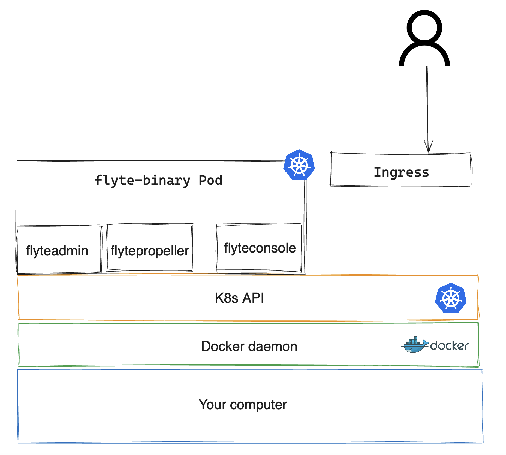

# KCD Mexico workshop: building a cloud-native platform for ML training from scratch

This is the logical architecture you'll be deploying and using:



## Pre-requisites

1. Docker Desktop
2. kubectl
3. minikube
4. python 3.9+

## Preparing a Kubernetes environment

1. Launch a new cluster

```bash
minikube start --driver=docker
```

2. Download the manifest for the Flyte dependencies:
```bash
curl -sl https://raw.githubusercontent.com/flyte-conference-talks/kcdmexico-2024/manifests/flyte-resources.yaml > flyte-resources.yaml
```
3. Submit the manifest:
```bash
kubectl create -f flyte-resources.yaml
```
3. Install Flyte:
```bash
helm install flyte-binary flyteorg/flyte-binary  --values values.yaml -n flyte
```
4. In three separate Terminal windows, start port-forwarding sessions to the following components:

Web console
```
kubectl -n flyte port-forward service/flyte-binary-http 8088:8088 
```

API endpoint
```
kubectl -n flyte port-forward service/flyte-binary-grpc 8089:8089 
```
minio (blob storage)
```
kubectl -n flyte port-forward service/minio 9000:9000 
```

5. Edit the `$HOME/.flyte/config.yaml` file to reflect the following:
```yaml
admin:
  endpoint: localhost:8089
  insecure: true
  authType: Pkce
```
6. Add and entry to your local DNS file so your `pyflyte` client is able to resolve the `minio` service name:
```bash
sudo vi /etc hosts

# Host Database
#
# localhost is used to configure the loopback interface
# when the system is booting.  Do not change this entry.
##
127.0.0.1       minio.flyte.svc.cluster.local
```

7. Download this demo workflow or simply start developing your own:

``` bash
curl -sl https://raw.githubusercontent.com/davidmirror-ops/flyte-the-hard-way/main/docs/on-premises/microk8s/demo.py > demo.py
```

8. Submit the workflow:
``` bash
pyflyte run --remote demo.py wf
```
Example output:
``` bash
Go to https://localhost:8089/console/projects/flytesnacks/domains/development/executions/f63a3e948256f4fd1b81 to see execution in the console.
```
> NOTE: instead of `8089` use `8088` as the port you connect to in the browser with the above link. All these limitations don't exist in production environments that make use of an Ingress or Service Mesh.

Follow the link and observe your workflow succeeding!
> The first run will take some time due to the download of the flytekit docker image

### Congratulations
You have setup a working Flyte environment on minikube
